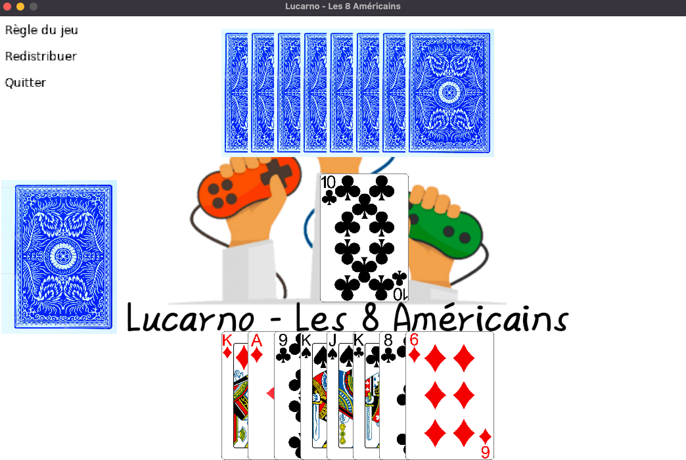
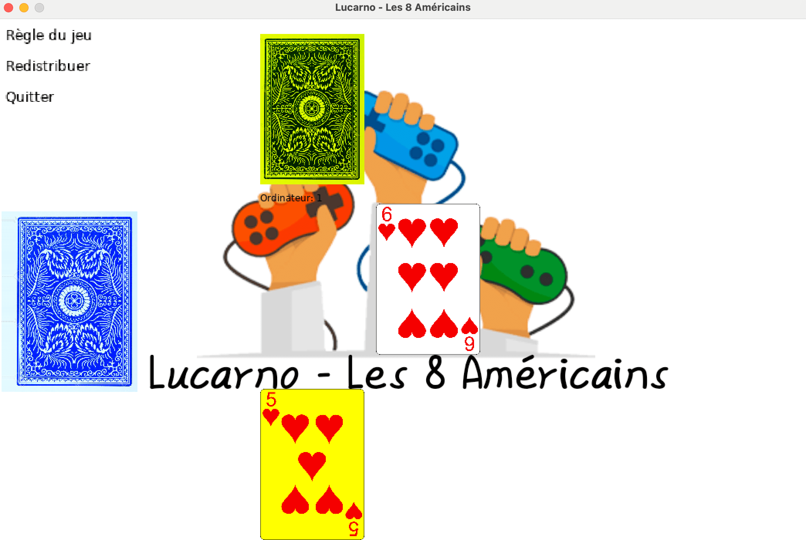

# Jeu des 8 Américains

## Description du Projet

Le projet consiste en la création d'un jeu de cartes des 8 Américains en utilisant Lua et Love2D. Le jeu permettra à 2 à 7 joueurs de jouer ensemble, en suivant les règles classiques du jeu.

## Fonctionnalités

- [x] Interface utilisateur intuitive pour la sélection des options et le déroulement du jeu.
- [x] Possibilité de jouer avec 2 à 7 joueurs.
- [x] Implémentation des règles classiques du jeu des 8 Américains.
- [x] Gestion des tours de jeu et des événements spéciaux.

## Captures d'Écran

